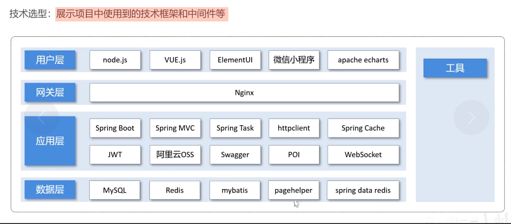
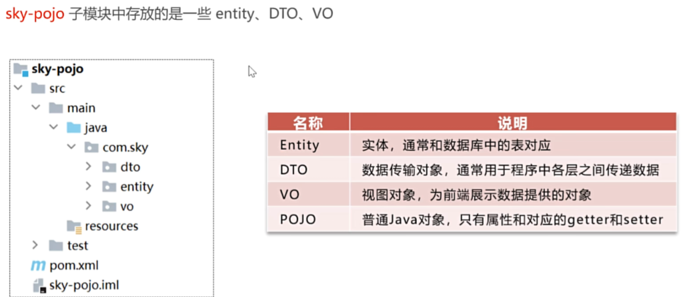
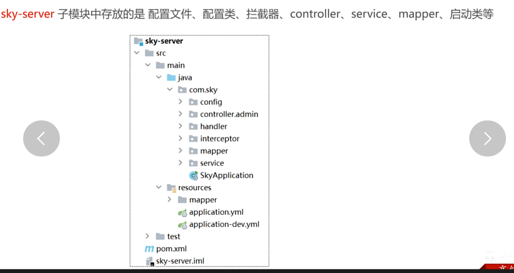
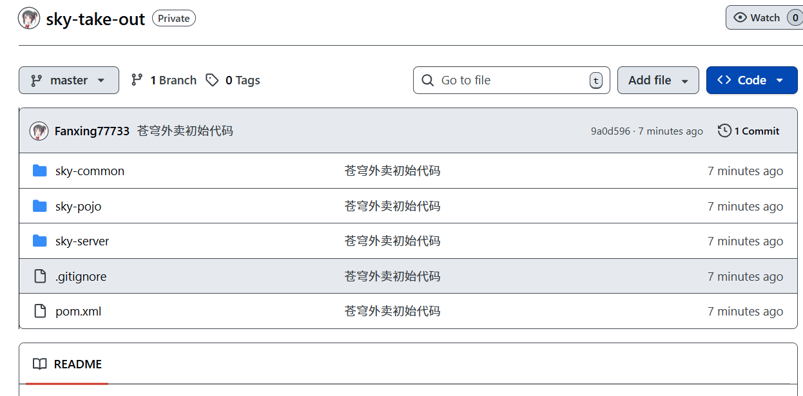
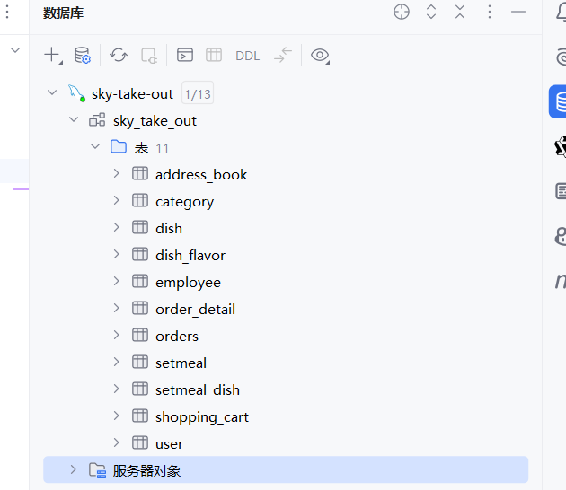
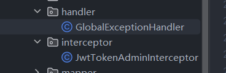
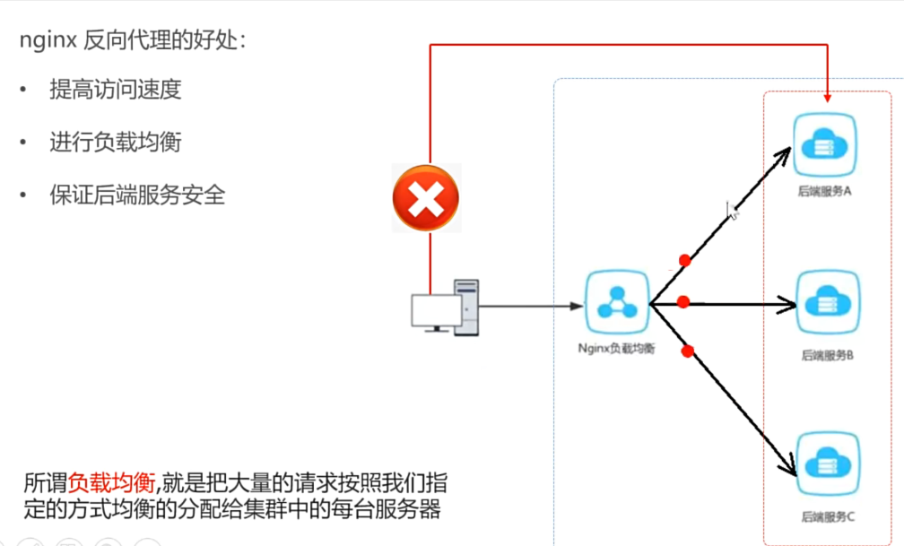

首先记录一下该项目使用到的技术选型



刚刚启动Nginx服务器弄了半天，原来是一个系统的广告把我的80端口给占了，无语，直接停掉他！
然后也是成功进来了


一些基础包该存放什么资源

pojo被划分为三个
DTO我目前可以理解为后端返回的封装的result对象？
这个很重要我觉得

然后是服务层了

除了我熟悉的controller,service,mapper，还有配置文件配置类拦截器什么的都在里面。不过拦截器也放在里面吗，先保留疑问


之后进行了一些git操作，先创建了本地仓库，然后推送的GitHub上



然后就是数据库的操作了，导入了一些表，这里我使用的是idea里面集成的数据库


emmmmm昨天没有学，弄了一晚上和一早上的本地部署cli和ai嵌入idea
基本以失败告终，显示弄了gemini，好不容易验证成功了，结果一直回答不了问题，显示抓取失败，其他几个等等也是
非常之难受，转念静下心一想，我现在的目标是苍穹外卖啊！
然后晚上花了时间取看了一下源码，把三层架构的原理弄得更清楚了,稍微看了看异常的架构，没太看懂。。。


第三天仍然停留在第一天。。。
其实主要是花了时间看源码，毕竟基础不是很好
刚刚看了一下泛型的用法，在result代码里面看的，下面记录一下

public class Result<T> implements Serializable {

    private Integer code; //编码：1成功，0和其它数字为失败
    private String msg; //错误信息
    private T data; //数据

    public static <T> Result<T> success() {
        Result<T> result = new Result<T>();
        result.code = 1;
        return result;
    }

这里面虽然很多T，但是用法其实都不一样
首先是public class Result<T> implements Serializable 的T
这里面的T表示封装的result对象里面可以接受多种类型

其次是private T data; /
因为data返回的类型多种多样，不好取确定一个类型，所以都接受，用泛型的话也不用强转

public static <T> Result<T> success() {
这个是一个静态方法，静态方法不能直接使用类上的T，所以要在static后面加一个T
而且作用域只在方法内，也是表示可以接受多种数据类型

然后然后就是扫荡了一下源码
用@Bean注解在配置类的方法上，就可以把第三方类的对象交给Spring管理

拦截器流程
请求来了
↓
【preHandle】登录校验、权限校验 → 如果不通过，直接返回401/403
↓
【Controller】执行业务逻辑
↓
【postHandle】统一处理返回值、记录日志
↓
【响应给前端】
↓
【afterCompletion】计算耗时、清理资源

拦截器和全局异常处理器的配合
// 请求 /user/-1

步骤1：拦截器preHandle
- 校验token ✅（用户已登录）
- 解析用户ID = 1001 ✅（当前登录用户是1001）
- 存入ThreadLocal ✅
- 返回true，放行

步骤2：Controller执行
- 接收路径参数 id = -1（这是要查询的用户ID，不是当前登录用户ID）
- 业务校验：id不能为负数
- 抛出BusinessException("用户ID不合法")

步骤3：全局异常处理器捕获
- 捕获到BusinessException
- 返回Result.error("用户ID不合法")

步骤4：拦截器postHandle
- 由于抛出异常，postHandle不会执行

步骤5：拦截器afterCompletion
- 拿到异常ex
- 计算耗时
- 清理ThreadLocal（清理的是登录用户1001的信息）
- 记录错误日志

步骤6：响应给前端
- 返回：{"code":0, "msg":"用户ID不合法", "data":null}


Nginx的反代理
前端后端路径不一样但却可以进行访问
是因为nginx进行了配置
nginx还有好处


随后讲了密码加密技术md5
数据库中和java中都要使用
数据库中直接用密文，java中接受前端传来的数据后要用md5将它加密，随后才能与数据库配对上实现登录


然后就是接口文档的导入工作
黑马教了yapi和swagger
但我听弹幕使用了apifox，idea里面插件就能用，很方便，先用着吧

随后问了lingma一些接口如何使用，现在不想看了，以后有空看
很好的问题！我来帮你理解在什么情况下使用 Headers、JSON Raw 等不同的请求配置。

让我先看一下你的拦截器配置：


**已查看文件** *JwtTokenAdminInterceptor.java*

**已查看文件** *WebMvcConfiguration.java*


完美！现在我来给你详细讲解如何判断使用 Headers、JSON Raw 等不同的请求配置：

## 📋 判断依据总结

### 1️⃣ **什么时候使用 Headers？**

**两种情况需要使用 Headers：**

#### ✅ 情况 1：接口被 JWT 拦截器拦截时
从代码第 36-37 行可以看到：
```java
.addPathPatterns("/admin/**")           // 拦截所有 /admin/ 开头的路径
.excludePathPatterns("/admin/employee/login");  // 排除登录接口
```


**判断方法：**
- 看接口路径是否以 `/admin/` 开头
- 看是否是登录接口（登录接口被排除，不需要 token）

**示例：**
```
❌ 登录接口 (/admin/employee/login) → 不需要 Headers
✅ 登出接口 (/admin/employee/logout) → 需要 Headers (token)
✅ 员工列表接口 (/admin/employee/list) → 需要 Headers (token)
```


#### ✅ 情况 2：接口需要从请求头获取参数时
比如文件上传时的 `Content-Type` 等

---

### 2️⃣ **什么时候使用 JSON Raw？**

**当接口方法有 `@RequestBody` 注解时**

看你的登录接口代码第 40-41 行：
```java
@PostMapping("/login")
public Result<EmployeeLoginVO> login(@RequestBody EmployeeLoginDTO employeeLoginDTO) {
```


**判断方法：**
- 方法参数前有 `@RequestBody` 注解
- 需要传递一个完整的 JSON 对象作为请求体

**示例：**
```json
{
  "username": "zhangsan",
  "password": "123456"
}
```


---

### 3️⃣ **什么时候使用 Query 参数？**

**当接口使用 `@RequestParam` 或没有特殊注解的简单参数时**

**示例：** 如果有一个查询接口：
```java
@GetMapping("/list")
public Result list(@RequestParam Integer page, @RequestParam Integer pageSize) {
```


在 ApiFox 中这样设置：
```
Query 参数:
Key: page        Value: 1
Key: pageSize    Value: 10
```


---

### 4️⃣ **什么时候使用 Path 参数？**

**当接口使用 `@PathVariable` 注解时**

**示例：**
```java
@GetMapping("/{id}")
public Result getById(@PathVariable Long id) {
```


在 ApiFox 中这样设置：
```
URL: http://localhost:8080/admin/employee/1
Path 参数: id = 1
```


---

## 🎯 实战应用：你的两个接口对比

### 登录接口 `/admin/employee/login`
```java
@PostMapping("/login")
public Result<EmployeeLoginVO> login(@RequestBody EmployeeLoginDTO employeeLoginDTO)
```


**ApiFox 配置：**
- ❌ Headers：**不需要**（被排除在拦截器外）
- ✅ Body：**需要**，选择 `raw` → `JSON`
  ```json
  {
    "username": "zhangsan",
    "password": "123456"
  }
  ```


---

### 登出接口 `/admin/employee/logout`
```java
@PostMapping("/logout")
public Result<String> logout()
```


**ApiFox 配置：**
- ✅ Headers：**需要**（路径匹配 `/admin/**`，需要 token）
  ```
  Key: token
  Value: <登录返回的 JWT 令牌>
  ```

- ❌ Body：**不需要**（方法没有参数）

---

## 📊 快速判断流程图

```
1. 看接口路径
   ├─ 是 /admin/employee/login？→ 不需要 Headers
   ├─ 是 /admin/** 其他路径？→ 需要 Headers (token)
   └─ 是用户端接口？→ 可能需要 user 的 token

2. 看方法参数
   ├─ 有 @RequestBody？→ 使用 JSON Raw (Body)
   ├─ 有 @RequestParam？→ 使用 Query 参数
   ├─ 有 @PathVariable？→ 使用 Path 参数
   └─ 没有参数？→ 不需要 Body
```


---

## 💡 记忆口诀

> **Headers 看路径**：`/admin/` 开头要 token（登录除外）  
> **Body 看注解**：`@RequestBody` 用 JSON Raw  
> **参数看类型**：`@RequestParam` 用 Query，`@PathVariable` 用 Path

现在你可以轻松判断在 ApiFox 中如何配置不同的接口了！有其他问题随时问我 😊

OK睡觉第一天的任务终于算是完成了！


