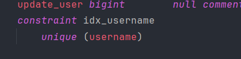
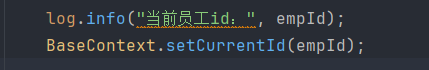
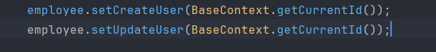
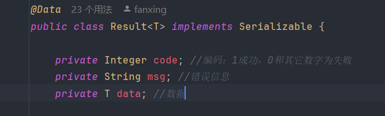
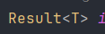
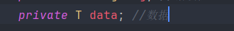
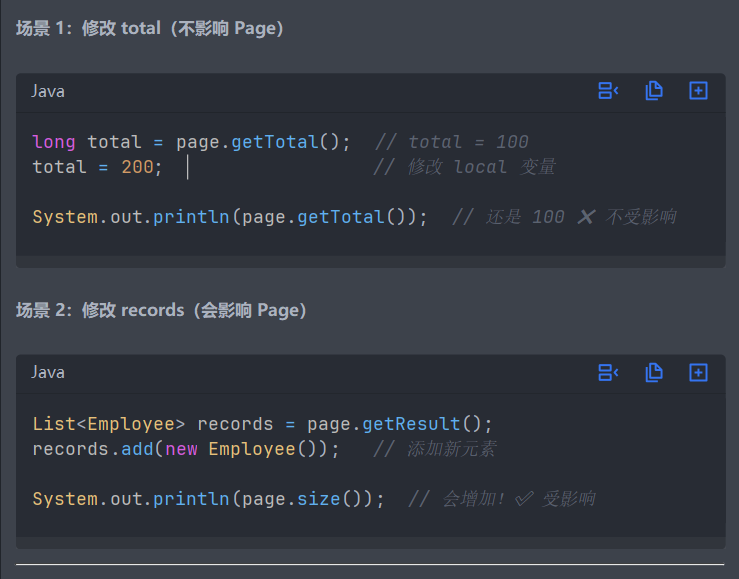
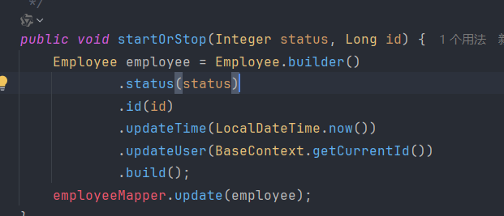
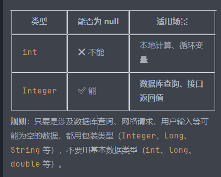
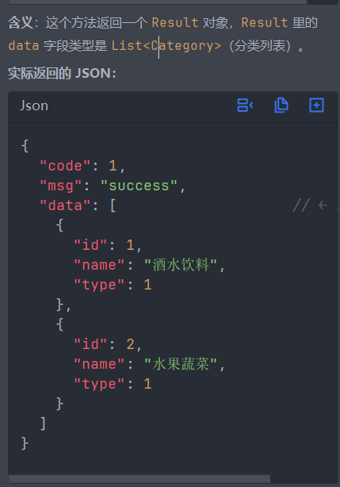

平常建表时
一般是 字段 字段类型 约束
比如 int username varchar(20) unique

还可以constraint一个名字来方便管理，相当于是给约束起了个名字，可读性高，更好维护

第二天
Requestbody注解将json格式转化为对象，通常在DTO里面使用

为什么用DTO来接收数据而不直接用现有的实体类
如果直接用实体类，前端传数据就会直接传给实体类，与数据库直接关系，可以恶意篡改数据，如果是DTO的话，就和数据库没有直接联系，后续类从DTO里面获得相应的数据，再给类的一些敏感数据强制赋值，比如密码，这样就不能通过注入造成安全隐患了。还有通常需要的数据只是实体类的一部分，造成冗余

DigestUtils.md5DigestAsHex() 需要接收 byte 数组作为参数，不能直接处理字符串。所以通常后面要加 .getBytes() 来将字符串转换为字节数组。

新增员工时，因为id不存在，所以会被拦截器拦截，测试时，要再请求头里面加一个token

String[] split = ex.getMessage().split(" ");
String msg = split[2] + MessageConstant.ALREADY_EXISTS;
将空格作为分隔符，通过分隔空格来确定字符串的位置
此次代码完善，原本只能捕获异常，现在通过全局异常处理器来捕获异常，并执行一些逻辑后返回给前端

每次发送一个请求，都是一个线程

static修饰变量跟方法有不同
// 表示这个变量属于类本身，而不是某个对象实例

// 效果：
✅ 全局唯一：整个应用中只有一个 threadLocal 实例
✅ 类加载时创建：类一加载就创建，不需要 new 对象
✅ 直接访问：可以通过 类名.变量名 直接访问

// 对比：
public static ThreadLocal<Long> threadLocal;  // ✅ 静态，全局一个
public ThreadLocal<Long> threadLocal;         // ❌ 实例变量，每个对象都有一个

ThreadLocal = 在当前线程（当前请求）中创建一个"全局变量"，哪里需要哪里拿，不用层层传递参数！

下面我梳理一下thread和 threadlocal
发送一次请求，这个线程就建立了，满足这个条件后，就可以使用threadlocal了，threadlocal为每个thread创造一个存储空间，可以隔绝线程，只有在同一个线程，能获得对应的值。

Thread = 执行者
ThreadLocal = 执行者的私人储物柜

通过thread和threadlocal解决了获得修改人的id的问题

第三天
刚刚深究了一下泛型

很不理解这个泛型的作用是什么，仔细深究Result的源码

仔细发现
早已经将date绑定在了T泛型上，所以这个pageResult就是指代T泛型了，接受PageResult类的数据！

第四天，绝对不能再进度这么慢了
一大早爬起来看了看昨天干的东西，详细看了pagehelper用法

    public PageResult pageQuery(EmployeePageQueryDTO employeePageQueryDTO) {
        PageHelper.startPage(employeePageQueryDTO.getPage(), employeePageQueryDTO.getPageSize());
        Page<Employee> page = employeeMapper.pageQuery(employeePageQueryDTO);
        long total = page.getTotal();
        List<Employee> records = page.getResult();
        return new PageResult(total, records);
这里是使用了pagehelper插件
Page类是插件提供的，里面包含两部分，一部分是他已经封装好了的分页数据，另一部分是查询数据。
查看源码可知，很像pageresult，将泛型绑定在查询数据上，因为这里查询的是对象信息，所以绑定employee。
所以我刚刚有个疑问，那total，records这两个数据，也不是employee类型啊，仔细研究发现他们是封装好了在Page类中的，有他们自己的类型

刚顺带记忆一下

基本和引用类型的区别

concat('%', #{name}, '%')
查询模板
如果直接写%name%，即固定要查询name这四个单词，而不是传进来的 name

param的意思是描述这个变量@param
在注释里面，后面不解释，所以会显示丢失标签，但是不影响运行

序列化将对象转json
反序列化反之

一般是查询类加泛型有必要

只是临时创建一个对象用来保存信息

账号锁定的原理原来如此简单
在登陆时查询到status等于0，就会直接抛出异常不让登录，就一句代码

        if (employee.getStatus() == StatusConstant.DISABLE) {
            //账号被锁定
            throw new AccountLockedException(MessageConstant.ACCOUNT_LOCKED);

在修改数据时，要先查询再更新，在浏览器看起来是在一个路径下做事，但其实查询和更新是两个路径,各功能都有一个接口，路径都不一样

然后就是导入了分类的代码，看了看源码

    public Result<String> save(@RequestBody CategoryDTO categoryDTO){
        log.info("新增分类：{}", categoryDTO);
        categoryService.save(categoryDTO);
        return Result.success("新增成功");
    }
我思考为什么这里要加泛型，不是没数据返回吗，结果是可以加上string类型可以返回字符串“新增成功”，完全可以不加泛型

这段删除代码很有意思
public void deleteById(Long id) {
//查询当前分类是否关联了菜品，如果关联了就抛出业务异常
Integer count = dishMapper.countByCategoryId(id);
if(count > 0){
//当前分类下有菜品，不能删除
throw new DeletionNotAllowedException(MessageConstant.CATEGORY_BE_RELATED_BY_DISH);
}

        //查询当前分类是否关联了套餐，如果关联了就抛出业务异常
        count = setmealMapper.countByCategoryId(id);
        if(count > 0){
            //当前分类下有菜品，不能删除
            throw new DeletionNotAllowedException(MessageConstant.CATEGORY_BE_RELATED_BY_SETMEAL);
        }

        //删除分类数据
        categoryMapper.deleteById(id);
    }
运用了逻辑外键来设定条件
为什么不用int用包装类？

虽然这里count不会返回null，但这是一种思想

第一次看有点蒙蔽，俩泛型写一起了

     public Result<List<Category>> list(Integer type){
        List<Category> list = categoryService.list(type);
        return Result.success(list);
  
 
原来是这样

至此，第二天的任务结束！之后尚且需要加快速度

