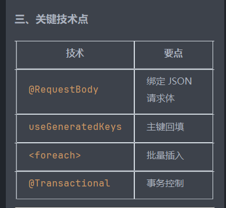
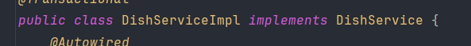
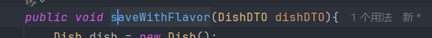
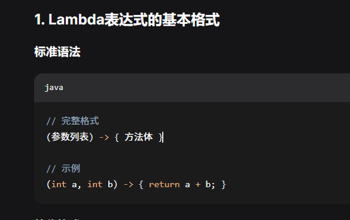
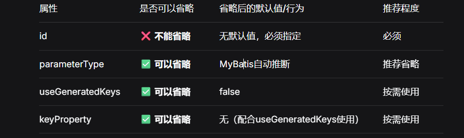
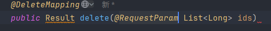
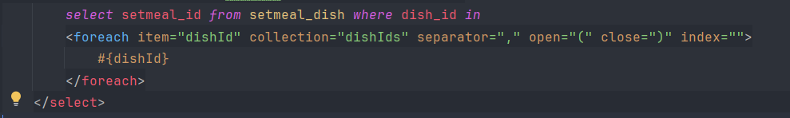
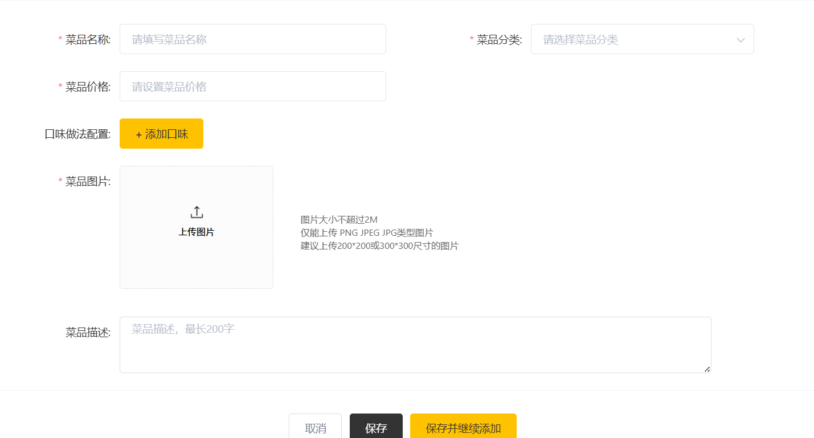

枚举，aop等还需细究
公共字段填充，如创建人创建时间这些可以复用的东西
可以使用aop
使用aop包含自定义注解，aop类
自定义注解用来识别需要aop的方法
aop类里面包括各种通知等

第二天，研究了一下代码，研究了反射
比如getDeclaredFields()来说
Declared指拿到所有的,包括私有变量，但是是只能看到，不能使用，使用得暴力反射
没有Declared指拿到public的
有s指拿到所有
没有s拿到单个

暴力反射就是指将权限设为true，就可以访问私有的成员变量setAccessible(true)

拿外卖的反射来理解
Method setCreateTime = entity.getClass().getDeclaredMethod("setCreateTime", LocalDateTime.class);
setCreateTime.invoke(entity, now);

Method和invoke是一对的。METHOD拿到方法和传参类型，invoke是传参实现
entity.getClass() 获取字节码文件用于反射
("setCreateTime", LocalDateTime.lass)前者是方法名，后者是数据类型.class,表示拿到该类型的一个数据对象
Method是方法反射，取方法后再用invoke传参

今天花了贼多的时间研究文件上传（阿里云OSS）
先讲讲流程，前端请求一张照片，首先拿到图片，然后上传到阿里云OSS，然后拿到OSS的图片地址，最后返回给前端url,前端可以解析url获取图片

这是yml配置，这样配置的话可以切换，非常灵活
先配置嘛，阿里云的各种信息。
有一个工具类和实体类，工具类里面有上传的方法，实体类里面可以拿到配置的数据
然后创建一个配置类，里面是工具类的构造方法，我研究了很久，按我现在的理解应该是模拟第三方类，然后用bean注解来return起到一个可以放到IOC容器管理的作用
所以后续可以直接autoweird获取工具类对象，然后调用上传方法

第三天
先放一张今天上午学到的截图大概详细的等下补充
首先各注解要记得，controller加@RestController @RequestMapping @SLF4J 后续在方法前加路径
Service加@Service ，实现类的话加@Service,还有需要的比如涉及到多表的话加@Transactional
Mapper加@Mapper
然后自动注入记得加@Autowired
接受前端的json记得加@requestbody
实现接口方法的时候记得implents
方法记得
然后口味表的具体操作回来再研究

lambda的基本格式
看这一段代码
if (flavors != null && flavors.size() > 0) {
flavors.forEach(dishFlavor -> {
dishFlavor.setDishId(dishId);
});
用到了foreach和lambda,foreach专门可以遍历集合，lambda是函数式编程，可以理解为匿名函数，可以理解为方法，但是方法不能有返回值，只能有void
匿名函数就是没有名字的方法

<insert id="insert" parameterType="Dish" useGeneratedKeys="true" keyProperty="id">

第四天
Query请求不是json，不用@RequestBody
完成了分页查询菜品，此次和上次有点不同，主要是在于用到了VO，因为要查询的字段里有一个是表里没有的，
而VO里正好封装了需要的全部字段，所以把接收类型改为VO,而且VO中没有的字段也不会被接收
VO通常是后端用来返回给前端的
PageHelper.startPage(dishPageQueryDTO.getPage(), dishPageQueryDTO.getPageSize());
分页查询的固定语句
还有最后一个不同的就是多表查询
涉及多表操作，增删改查一般只有查写在同一个sql语句中
select dish.* , category.name as category_name from dish left join category on dish.category_id = category.id

多对多必须要有中间表

休息摆烂了俩天

解析字符串，把ID提取出来，实现批量删除
mapper和表是一一对应的关系
我刚不理解为什么不用dish表
因为这个要操作的是另一张表

dishId即item是一个临时变量，给占位符传值，所以名字得一样

这是个新业务，但是又有查询分类的功能，但不用再写代码
因为他是一个接口，点一下他他就会跳转到对应接口

后面又是几个业务，代码大差不差，流程已经逐渐熟练了
但是sql语句尤其是动态的不是很熟练，有机会多练练
到此第三天的任务终于是落下帷幕

 