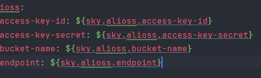

枚举，aop等还需细究
公共字段填充，如创建人创建时间这些可以复用的东西
可以使用aop
使用aop包含自定义注解，aop类
自定义注解用来识别需要aop的方法
aop类里面包括各种通知等

第二天，研究了一下代码，研究了反射
比如getDeclaredFields()来说
Declared指拿到所有的,包括私有变量，但是是只能看到，不能使用，使用得暴力反射
没有Declared指拿到public的
有s指拿到所有
没有s拿到单个

暴力反射就是指将权限设为true，就可以访问私有的成员变量setAccessible(true)

拿外卖的反射来理解
Method setCreateTime = entity.getClass().getDeclaredMethod("setCreateTime", LocalDateTime.class);
setCreateTime.invoke(entity, now);

Method和invoke是一对的。METHOD拿到方法和传参类型，invoke是传参实现
entity.getClass() 获取字节码文件用于反射
("setCreateTime", LocalDateTime.lass)前者是方法名，后者是数据类型.class,表示拿到该类型的一个数据对象
Method是方法反射，取方法后再用invoke传参

今天花了贼多的时间研究文件上传（阿里云OSS）
先讲讲流程，前端请求一张照片，首先拿到图片，然后上传到阿里云OSS，然后拿到OSS的图片地址，最后返回给前端url,前端可以解析url获取图片

这是yml配置，这样配置的话可以切换，非常灵活
先配置嘛，阿里云的各种信息。
有一个工具类和实体类，工具类里面有上传的方法，实体类里面可以拿到配置的数据
然后创建一个配置类，里面是工具类的构造方法，我研究了很久，按我现在的理解应该是模拟第三方类，然后用bean注解来return起到一个可以放到IOC容器管理的作用
所以后续可以直接autoweird获取工具类对象，然后调用上传方法

