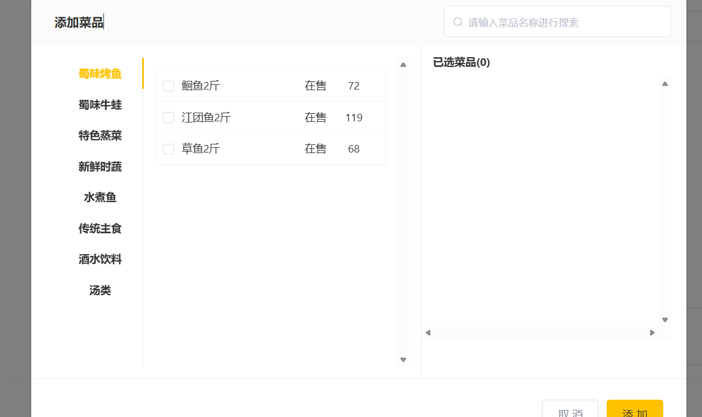
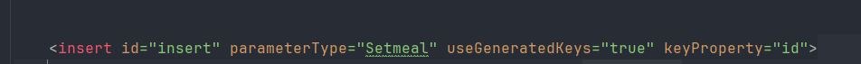

第一个问题碰到了

`public void saveWithFlavor(DishDTO dishDTO) {
Dish dish = new Dish();
dish.setName(dishDTO.getName());
dish.setCategoryId(dishDTO.getCategoryId());
dish.setPrice(dishDTO.getPrice());
dish.setImage(dishDTO.getImage());
dish.setDescription(dishDTO.getDescription());
dish.setStatus(dishDTO.getStatus());
dishMapper.insert(dish);`

为什么不直接用DTO而是要new一个dish对象？
我记得之前好像回答过这个问题，果然需要回顾前面的内容再来进行代码编写！

完成了套餐新增功能
遇到的问题如下

我一直觉得这个接口已经完成，疑惑一开始为什么没有数据

后来得知，这和之前写的不是一个接口，这个是通过分类ID来查询菜品
而之前是通过id查询菜品

一些接口路径一般都是符合规范的，比如分页查询就是page，根据什么id查询什么就是list

然后一个比较大的问题就是如何插入两个表的数据了，这次解决方案跟上次一样

先插入一个表获得id信息，再给这个传过来的数组设置一个id再插入就可

要获得ID要先

完成了分页查询功能，流程大差不差
主要难点如下
这种分页查询数据，前端传过来的一般封装为DTO，后端传回去VO封装

    public PageResult pageQuery(SetmealPageQueryDTO setmealPageQueryDTO) {
        PageHelper.startPage(setmealPageQueryDTO.getPage(), setmealPageQueryDTO.getPageSize());
         Page<SetmealVO> setmeals = setmealMapper.pageQuery(setmealPageQueryDTO);
        return new PageResult(setmeals.getTotal(), setmeals.getResult());

Page<SetmealVO> setmeals = setmealMapper.pageQuery(setmealPageQueryDTO);

注意这句代码，Page类是插件提供的，泛型为封装好的

上次也说了，Page类有两部分，一部分是分页数据，另一部分是封装好的数据

完成了批量删除功能
@RequestParam 解析ids，将id各个传进来
还是要先判断是否在起售中，要不然会造成数据问题

这次删除用的不是上次的循环单个删除，这次用的是编写动态sql，将ids传进去，就不用循环了 

完成后续功能开发/
发现那个集合还真得用list，不然关联不上，以后深究一下

还保留了几个疑问
一是新加套餐那里不显示新数据
二是修改时查出来不会显示菜品
三是代码逻辑再看看，修改的

解决
一是因为在停售状态
二是因为数据库上次叫ai帮我插入的数据匹配的id值他是乱写的

三我悟了
代码是先全部删除该套餐的菜品再插入新的
但实际调试中发现是可以保留菜品的，比如有两个菜品，可以只删除一个
但我纳闷了，代码层面不是全部删除了吗，为什么还能保留呢
原因是因为查出来的数据就把他当作新数据，传过去更新的时候包括保留的数据和新数据
就是说先全部删除再全部插入

至此第四天完成

