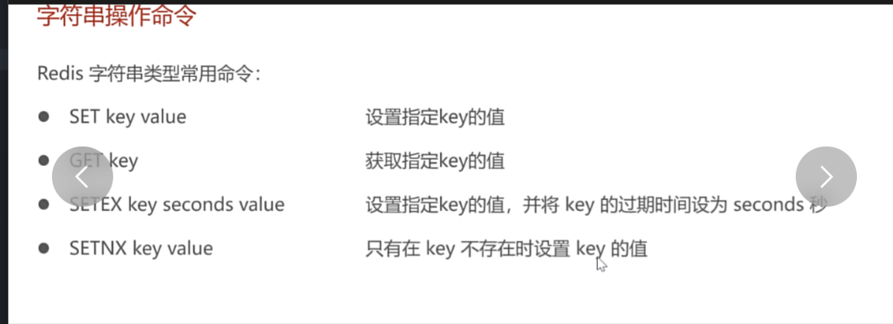
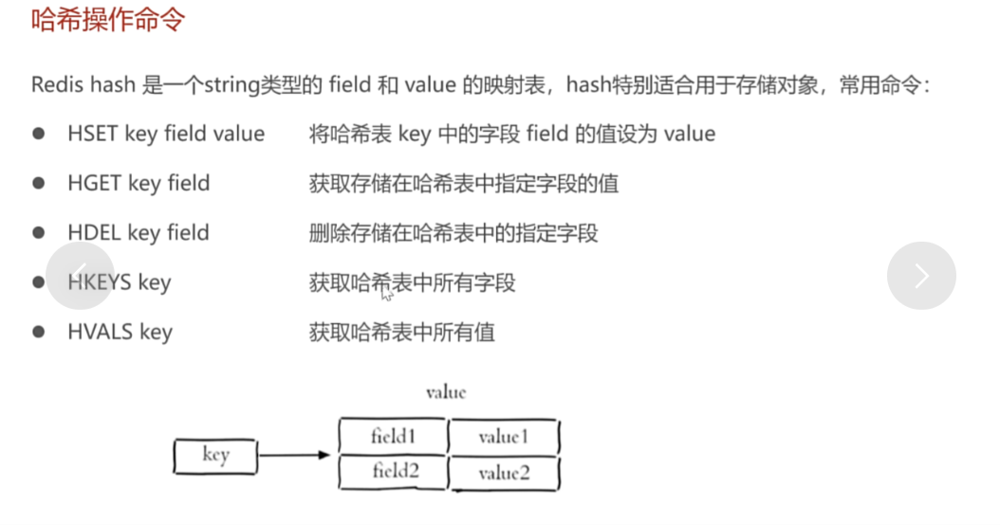
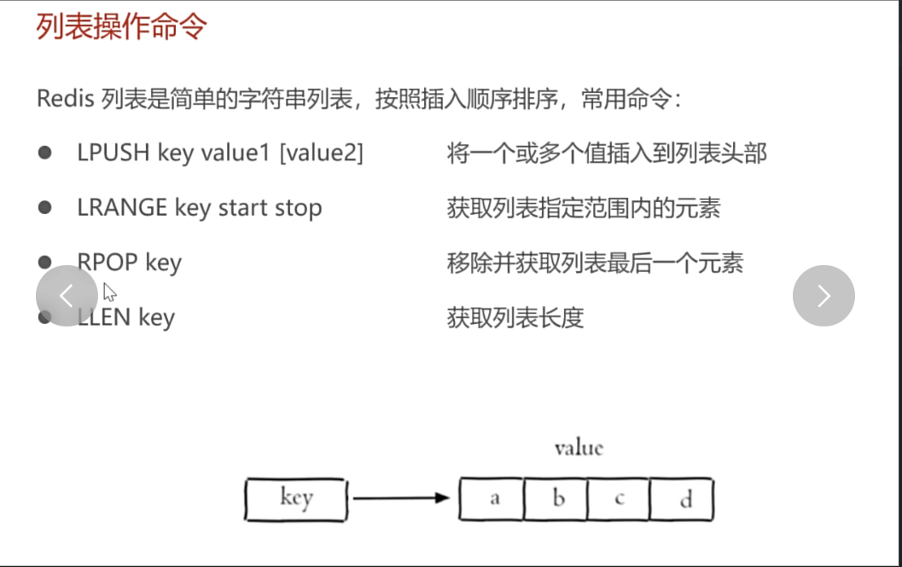
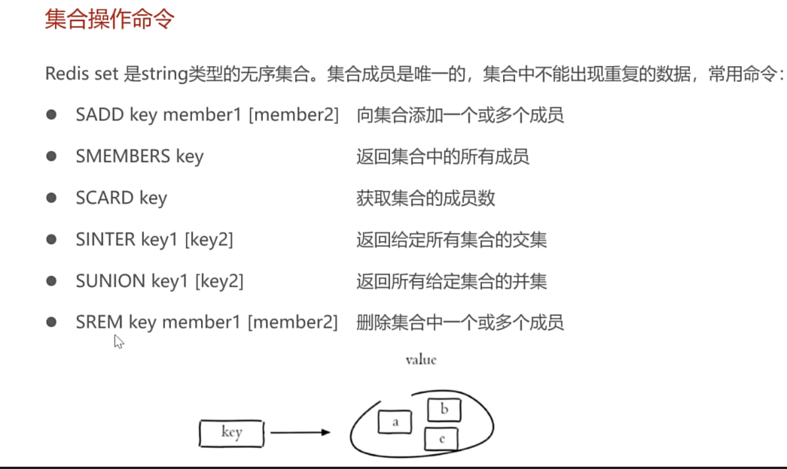
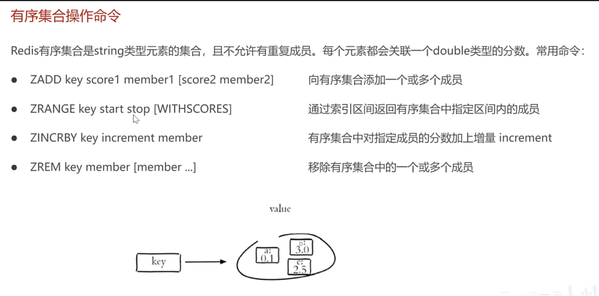
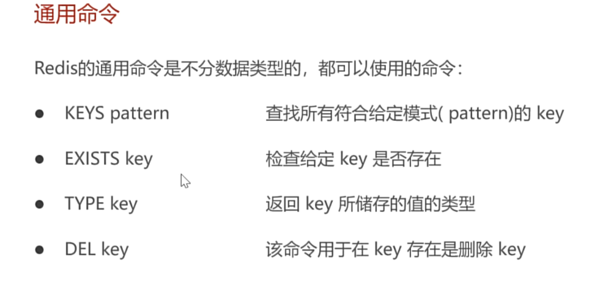
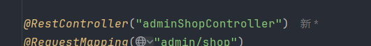

各种类型

LR都可，双向的

Zset只不过是set加了个分数进行排行而已

图中的画的图很形象

redis配置类，redistemplate就像一支笔，有这支笔才能操作数据库

    public RedisTemplate redisTemplate(RedisConnectionFactory redisConnectionFactory) {
        log.info("开始创建RedisTemplate对象...");
        RedisTemplate redisTemplate = new RedisTemplate();
        //设置redis连接工厂对象
        redisTemplate.setConnectionFactory(redisConnectionFactory);
        //设置redis的key的序列化器
        redisTemplate.setKeySerializer(new StringRedisSerializer());
        return redisTemplate;
    }
看这段代码，RedisConnectionFactory是框架提供，里面包括各种配置信息，启动时他就会扫描然后把各种信息装进去然后注入进来

//❓ 为什么需要 @Bean？
//RedisTemplate 是第三方类（Spring 提供的）
//Spring 不知道如何配置它（需要设置连接工厂、序列化器等）
//必须手动创建并交给 Spring 容器管理
//❓ RedisConnectionFactory 从哪来？
//不是你手动创建的
//是 Spring Boot 根据配置文件自动创建的
//包含了 Redis 服务器的所有信息（host、port、database 等）
//❓ 为什么要设置序列化器？
//不配置的话：Key 在 Redis 中是乱码（如 \xac\xed\x00\x05t\x00\tcategory_1）
//配置之后：Key 是正常的字符串（如 category_1）

之后操作redis数据库完成更改店铺状态和查看店铺状态的操作
因为这种操作数据不多，所以不适合在sql中建表

主要遇到的问题如下

因为admin和user俩个都要查询，但接口路径不一样，所以要创建俩个controller，同名的情况下可以在restcontroller操作

其他的没什么，就是操作redistemplate这支笔对数据库进行操作

最后说一下 java中操作redis用的是spring框架提供的，所以命令跟之前截图的不一样