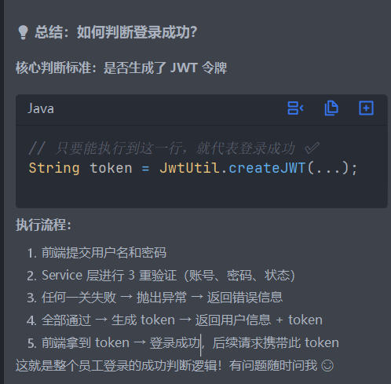

今天上午感觉没做什么事啊
理解了一下httpclient的作用，相当于浏览器，发送请求得先打开浏览器对吧

然后创建请求对象，get post之类的

然后接收结果等等

现实中已经封装好为工具类

然后申请了微信小程序，下载了微信开发者工具
了解了一些基础前端代码
比如.js控制逻辑，.wxml控制页面等

还有微信登陆的流程

                                                              │
│  【第 1 步】用户点击登录按钮                                    │
│     小程序调用 wx.login()                                     │
│         ↓                                                     │

│  【第 2 步】微信返回 code (临时登录凭证)                        │
│     code = "07 1xxx..."                                        │
│         ↓         
│
│  【第 3 步】小程序发送 code 到你的后端                          │
│     POST /user/login                                         │
│     请求体：{ "code": "071xxx..." }                           │
│         ↓           
│
│  【第 4 步】你的后端拿 code 请求微信服务器                       │
│     GET https://api.weixin.qq.com/sns/jscode2session        │
│         ?appid=xxx&secret=xxx&js_code=071xxx...              │
│         &grant_type=authorization_code                        │
│         ↓        
│
│  【第 5 步】微信返回 openid + session_key                      │
│     {                                                         │
│       "openid": "用户唯一标识",                                │
│       "session_key": "会话密钥"                               │
│     }                                                         │
│         ↓       
│
│  【第 6 步】你的后端生成 JWT token                             │
│     把 openid 等信息加密成 JWT                                  │
│     token = "eyJhbGciOiJIUzI1NiIsInR5cCI6..."                │
│         ↓       
│
│  【第 7 步】返回 token 给小程序                                 │
│     Result<String>                                            │
│         ↓       
│
│  【第 8 步】小程序保存 token                                   │
│     wx.setStorageSync('token', token)                         │
│         ↓      
│
│  【完成】后续请求都带上这个 token                               │
│                                   

openid在同一个应用中是不变的
在不同是不一样的/
每次请求的code都不一样

token的生成
用户登录成功
↓
服务器使用密钥 "itheima" + 用户信息 (userId)（还有ttl）
↓
通过 HS256 算法签名生成 JWT 令牌
↓
返回给前端：token = "eyJhbGciOiJIUzI1NiIsInR5cCI6IkpXVCJ9.xxxxx"

调用微信登陆其实就是获得三个东西，id，openid，token

id通过后端查表，新用户会新生成一个id，然后通过xml语句设置条件获得id

openid通过给微信发送一个map集合，包括code之类的信息，然后他会给你返回一个openid

token的生成如上所示

如何判断是否登陆成功

token是关键，不然会被拦截

用户端也要配置拦截器，即jwt校验

配置好后还要在配置里面进行注册
registry.addInterceptor(jwtTokenUserInterceptor)
.addPathPatterns("/user/**")
.excludePathPatterns("/user/shop/status")
.excludePathPatterns("/user/user/login");

然后就是导入了用户浏览商品的代码，至此第六条结束
