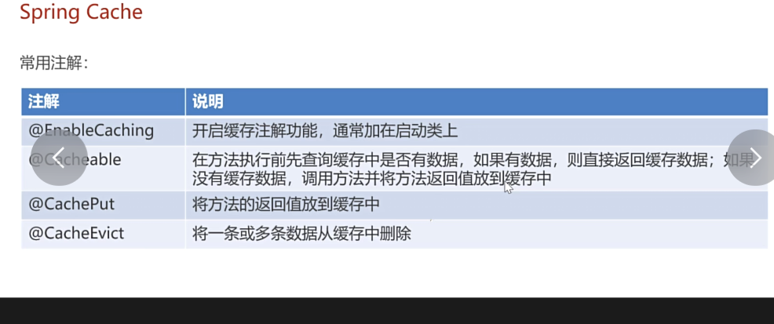
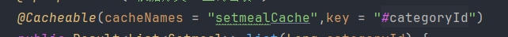
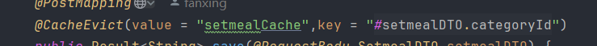

如果不用redis，用户每次点击都会去查询sql表，很慢

用redis将数据存储到内存，快

流程：先按约定构造好key

然后查询key中有无数据

若有直接返回

若无执行查询数据库的流程，并把数据缓存到redis中

sql与redis如何保持数据一致性呢？

当sql数据更改时，执行方法删除缓存的方法

`private void cleanCache(String pattern) {
Set keys = redisTemplate.keys(pattern);
redisTemplate.delete(keys);
}`

pattern表示将传进来的字符串作匹配

因为很多操作涉及到多个表，很复杂，所以直接删除所有的，新增不用，可以精确知道分类id

说简单点就是sql数据库发生改变了，先把缓存全删掉，然后用户查询时再缓存

springboot中redis的使用

像catchable，transactional,这类的注解，用于增强功能

本质上就是基于动态代理实现的，你自己不用实现，都是spring自动创建对象帮你实现的

动态代理方法的调用是依靠反射实现的，注意字节码生成这一步不属于反射

用注解的redis就方便的多

查询操作用

增用

改删，起售停售用，增也可以直接全删再查 

然后就是对购物车这个模块的开发了

首先是购物车的添加，一开始我总纳闷怎么不用数据回显，原来后面还有查看购物车，所以不用返回数据

购物车的添加主要有一点和删除一样的吧，就是你得先判断是不是已经添加或删除了这个菜品

如果有的话，加一减一即可，再插入，如果没的话，直接插入数据

还有一个注意的点就是前端并没有传userid，是靠threadlocal拿到的

但好像我有个疑问为什么购物车模块没有用到redis呢?

ok，这一天完成，这好像是第一天用一天完成一天任务，果然终究还是得要有动力啊，继续保持！