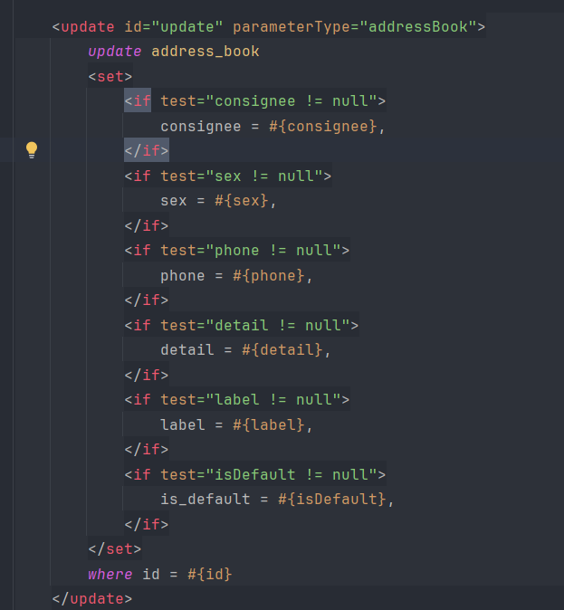
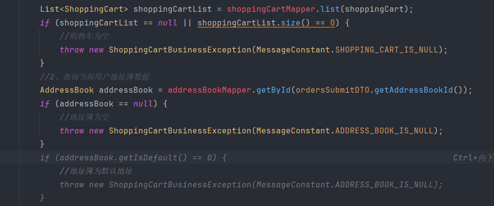
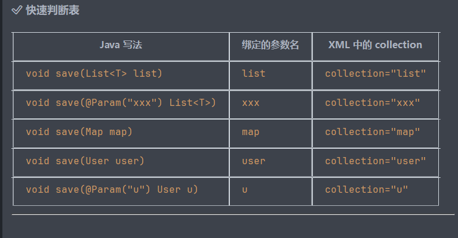
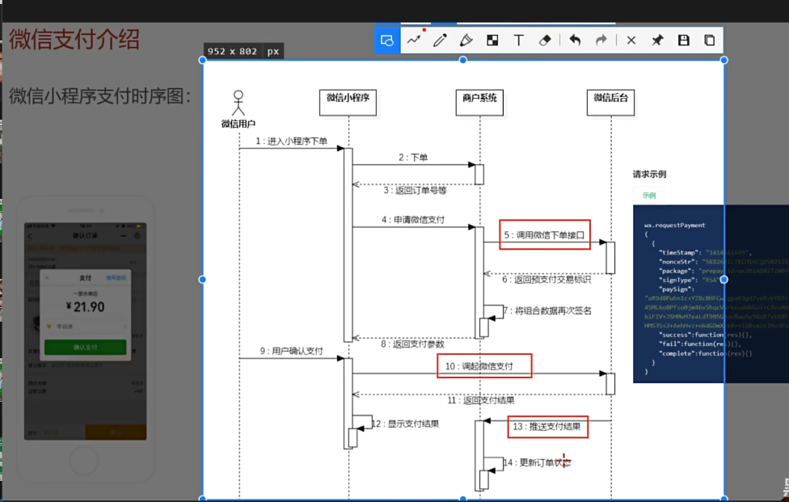

疑问：parameterType="addressBook" 是什么？是类名吗？

✅ 核心结论

parameterType="addressBook" 不是完整类名，而是 MyBatis 类型别名

等价于 parameterType="com.sky.entity.AddressBook"

MyBatis 默认规则：简单类名首字母小写作为别名

AddressBook → 别名 addressBook

Employee → 别名 employee

    @Update("update address_book set is_default = #{isDefault} where user_id = #{userId}")
    void updateIsDefaultByUserId(AddressBook addressBook);
为什么传进去的是一个对象，但他所需要的是两个个属性，怎么拿到的？

MyBatis 内部处理过程：
MyBatis 收到参数对象 AddressBook
使用反射查找名为 userId 的 getter 方法
调用 addressBook.getUserId() 获取值
将值绑定到 SQL 的 #{userId} 占位符
主要依赖于反射机制

刚才我疑问为什么修改默认地址不直接传id，要传一个对象呢？

其实这个操作本就是一个更新操作，要设置isdefault，要传userid，要传id

到最后还是要传一个对象，就算你传id也要新建一个临时对象把这些值放进去，再加上保持设计风格，update还是传对象

这段代码很有意思，就我们平常点外卖而言，如果购物车为空是不能下单的，这属于前端校验

但是有人用postman点外卖绕过前端呢哈哈哈，还有一些使坏的所以还得进行后端校验

String.valueOf() 是 Java 的类型转换方法，用于将其他类型转换为 String 类型。

今天晚上找两个bug找了很久，所以应该是今天学不完了

讲一讲遇到的俩bug

第一个是ai补全的问题，有一个必须传的参数ai弄错了，导致插入表失败抛异常

第二个很迷，就是foreach 的collection的问题，用集合的名字不行，提示找不到这个参数，但用list就可以了
但是我看了别的xml语句有的用集合的名字又可以，很迷，问ai也模棱两可

所以整理了一下原因

刚试了下绑定param参数，也可以实现\

微信支付时序图

内网穿透，就是通过一个软件将一个本地端口变成一个公网端口

因为微信支付需要把信息回调给商户系统也就是后端，但是端口是本地的，所以需要内网穿透

等项目上线后，就有公网ip，不用穿透了

然后就是实现流程的代码，很复杂，而且要用到商品id什么的暂时没有
所以流程什么的也只是了解一下
把代码导入了

new了一个空对象绕过微信支付接口

