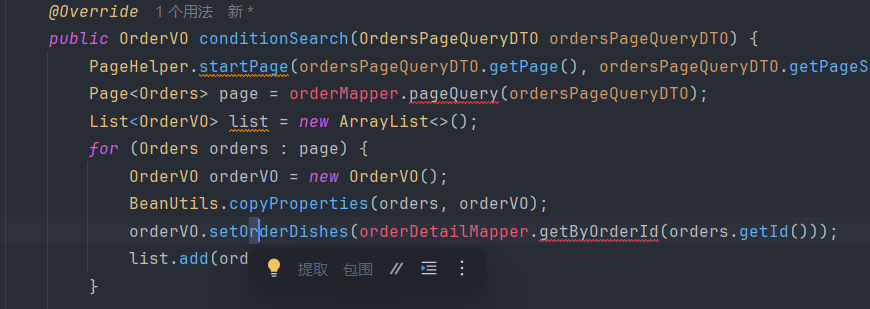
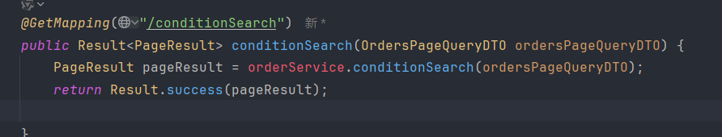
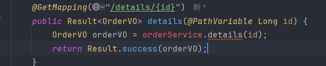
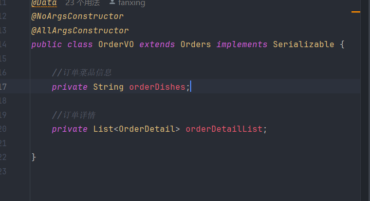

第一个卡壳地方，分页查询不知道最后怎么弄，如何在集合中取值


这里搞错了，以为是数据类型是VO,这里返回给前端的肯定是一个pageresult，vo只是封装在pageresult中


跟这个有点不一样,这里是需要的result是vo类型的，上面那个需要的是pageresult，vo封装在




xml中不能用//注释。。。。


SHIT!
再一次被requestbody坑了，以后查不到数据的时候第一时间看看是不是json！！！


不能光看接口文档，如果文档说是传id，但没有路径参数的时候，先试试传DTO


我现在有个疑问，商家拒单或取消订单的理由用户怎么看到的


因为拒单 取消订单设计到微信支付，所以要抛异常


我现在做的支付功能是从预支付哪里就绕过了，所以点击去付款就会直接更改数据库，不用确认付款


完成了管理端
总结一下，业务代码都差不多，没有什么难点

重要的就是做一些校验吧，先判断符不符合这个条件，不符合跳异常下面就不会执行了，符合就可以走下去


我刚有个疑问，就是点击选择了按菜品匹配餐具，我并没有实现这个功能，他是怎么计算的
 
✅ 餐具数量自动匹配菜品数量是前端实现的智能功能
✅ 后端只负责接收并保存到数据库
✅ 这样设计合理：前端更了解用户操作，后端只需存储数据


我刚好奇为什么vo只有两个属性可以装二十多个属性，原来他继承了



这段代码有点意思，有几个让我学到了

第一是增强for循环，因为orderdetaillist是orederdetail类型的，所以不能直接用购物车来接收。。
你想想 orderlist本质是一个数组，肯定要是同类型的来接收，后面再赋值给其他就好


第二是一开始把购物车对象放到外面了，我有点忘记前面了，把购物车看成了一个整体，以为他装整个list，其实一个购物车就对应一个菜品
````````````````````````````````````````````````/**
```* 再来一单
````````````* @param id
*/
public void repetition(Long id) {
List<OrderDetail> orderDetailList = orderDetailMapper.getByOrderId(id);
for ( OrderDetail orderDetail : orderDetailList) {
ShoppingCart shoppingCart = new ShoppingCart();
BeanUtils.copyProperties(orderDetail, shoppingCart);
shoppingCart.setUserId(BaseContext.getCurrentId());
shoppingCart.setCreateTime(LocalDateTime.now());
shoppingCartMapper.insert(shoppingCart);
}```````````````````````````````````````````````````````````````


最后调用了百度api校验地址，了解了大概的过程就是计算经纬度之类的然后判断距离，业务代码是复制的，我自己申请了百度的资格，然后设置了白名单0.0.0.0/0
说是有风险，但是能成功，而且sn方式我失败了

至此第九天结束了


