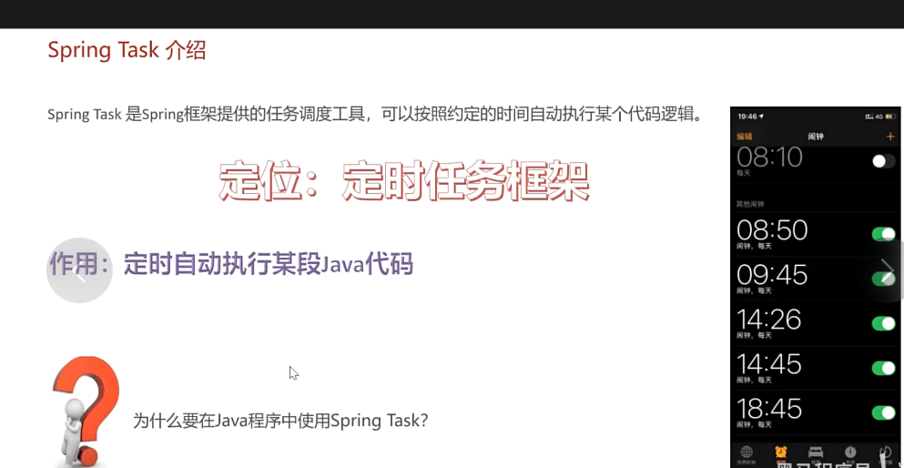
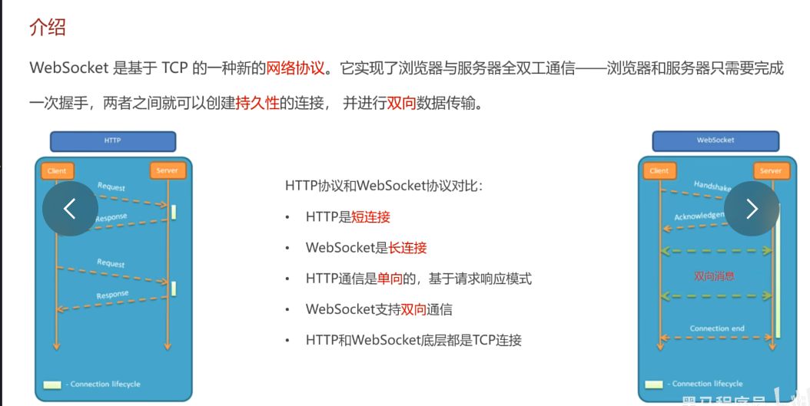
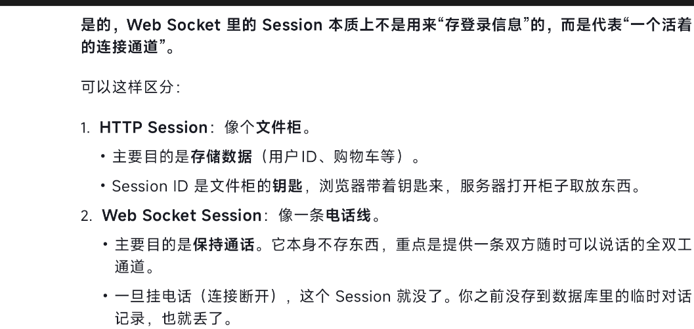

springTASK的作用

流程就是记得加注解，然后设置定时的时间条件

然后他不是一个请求，而是一个自动化的东西，所以不需要controller和service

只需要再mapper层去对数据库进行操作即可

websocket

也是一种协议

相较于http来说，是全双工的，是实时的，不用靠刷新来获得新数据

ws的session和http的session不是一个东西

ws的session是一个标识，让浏览器知道他在跟谁连接

http的session是存储的用户信息，下次携带这个可以直接登陆

然后现在完成了接单和催单功能

接单功能发生在支付后，所以加在支付代码成功后面，用一个map集合装数据，然后转成json，然后通过websocket发送到浏览器

然后出了个小插曲，总之原因是因为没拿到id，解决了

催单功能因为是用户主动发起的，所以需要一个接口，然后还是一样的建立map集合，然后转成json，然后通过websocket发送到浏览器

至此第十天完成