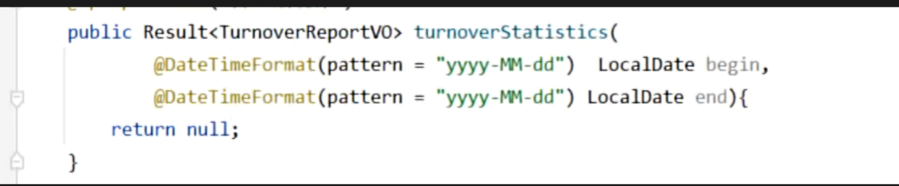
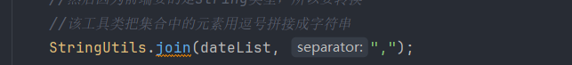
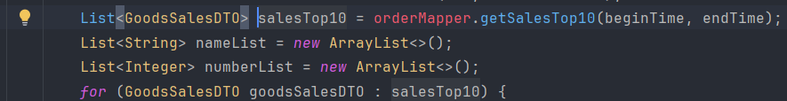

要用日期作为注解的话，记得使用DatetimeFormat这个注解

**该工具类可以转换成字符串并用逗号拼接**
 

这段代码很有意思，获得日期范围
//集合用于存放范围内日期

`List<LocalDate> dateList = new ArrayList<>();
        dateList.add(begin);
        while (!begin.equals(end)) {
            begin = begin.plusDays(1);
            dateList.add(begin);
        }`

and order_time &gt;= #{begin}
//&gt; 为大于 l为小于

        //集合用于存放日期对应的营业额
        List<Double> turnoverList = new ArrayList<>();
        for (LocalDate date : dateList) {
            LocalDateTime beginTime = LocalDateTime.of(date, LocalTime.MIN);
            LocalDateTime endTime = LocalDateTime.of(date, LocalTime.MAX);
            Map map =new HashMap<>();
            map.put("begin", beginTime);
            map.put("end", endTime);
            map.put("status", Orders.COMPLETED);
            Double turnover = orderMapper.sumByMap(map);
            turnover = turnover == null ? 0.0 : turnover;
            turnoverList.add(turnover);

这段代码也值得回味，首先毫无疑问要创建一个数组存放数据，然后循环遍历

重点来了，date是Localdate类型的，但是我们查询因为是查询当天的范围，所以需要精准到时分秒为localdatetime类型

然后需要转换，LocalDateTime.of(date, LocalTime.MIN);求最小时间，最大类似

然后还用了map存放数据,这个前面用的不多

为什么用 Map？
优点：
灵活扩展 - 新增条件只需 map.put()，无需改方法签名
MyBatis 动态 SQL - <if test="xxx != null"> 天然支持 Map
避免参数过多 - 如果查询条件有 5-6 个，方法签名会很冗长
缺点：
类型不安全（编译期不检查 key 是否正确）
可读性差（不知道 map 里有什么）

然后为什么用double类型来存放营业额数据？因为包含小数点

**_**刚刚做完了，今天的任务分为四个统计任务**

**四个任务业务流程基本相同，基本都是传时间范围进来，然后设置最小时间和最大时间**

**然后编写sql语句，根据时间查出相应的数据**

**然后创建集合对象来接收各数据，视频用的stream流，我不太会，所以自己用的for循环解决的**

**然后最后因为前端要的是string类型，所以要用到上面说的那个工具类来转换成字符串并且用逗号拼接**

**然后返回VO对象**_**

上次我也记录了，这里我再记录一下这个泛型和循环的联动

循环遍历一定是要相同的数据类型的