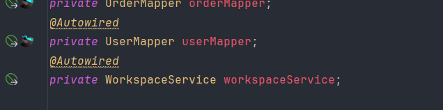
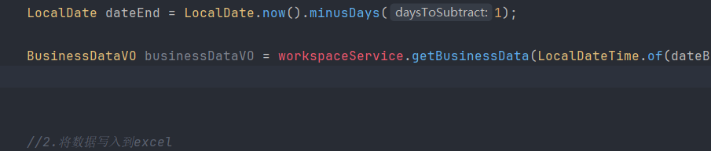
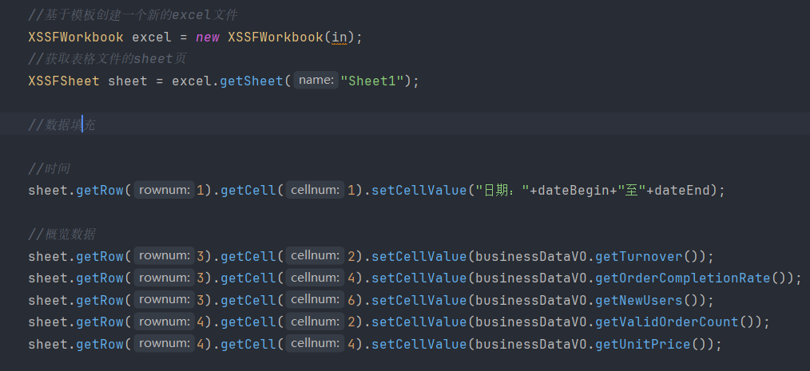

工作台由于功能之前基本实现而且流程基本一样，所以直接代码导入

看代码的时候我有个疑问，明明在这个工作台接口没写相关的订单查询代码，为什么前端还是显示了

工作台页面
├── 订单概览卡片 → 调用 /admin/workspace/overviewOrders
├── 今日数据统计 → 调用 /admin/workspace/businessData  
└── 订单列表区域 → 调用 /admin/order/conditionSearch (复用订单管理接口)

他可能直接用了之前的接口

设计报表部分，除了传值外的复杂部分，完全可以直接鼠标编辑报表

这段代码，括号里的参数哪来的？

    @GetMapping("export")
    public void export(HttpServletResponse response) {
        log.info("导出数据报表");
        reportService.exportBusinessData(response);
    }

浏览器请求 → Tomcat 创建 response 对象 → 你的代码往 response 里写数据
→ Spring/Tomcat 自动把 response 的内容发送给浏览器

Tomcat 创建的 response = 真实有效的快递单（有物流系统支持，能真正送到）
你自己 new 的快递单 = 随便画的纸（格式一样，但快递公司不认，送不到

类比：
就像你在餐厅：
服务员给你餐盘（response）
你往餐盘里放菜（写数据）
服务员自动端走送给客人（框架自动发送）
你不需要自己跑去送（不用手动返回给服务器）
总结：你只负责填充内容，发送工作由框架自动完成

实现类里面我们通常都是自动注入mapper，但是也可以注入service去调用别的service的方法

如

调用 了别人的方法

流程
1. 查询数据库得到业务数据
2. 读取 Excel 模板
3. 填充数据到 Excel**（此时还在内存中）**
4. 获取输出流 out（建立通往浏览器的通道）
5. excel.write(out) → 把 Excel 二进制数据通过 out 传给 response
6. Tomcat 自动把 response 的内容发送给浏览器
7. 浏览器弹出下载框

流程很清晰

首先创建一个模板，再根据模板创建新的excel文件

再在这个新文件中创建sheet页，再在对应的行和单元格放入数据

最后通过数据流向excel下载到浏览器
`ServletOutputStream out = response.getOutputStream(); //获取输出流，建立通往浏览器的通道
excel.write(out); //把 Excel 二进制数据通过 out 传给 response
out.close(); //关闭流
excel.close();
`

服务器内存中的Excel对象
↓ excel.write(out)
ServletOutputStream (写入response响应体)
↓ Tomcat封装HTTP响应
HTTP响应包(包含Excel二进制数据)
↓ 网络传输
浏览器接收响应
↓ 解析并保存
用户本地磁盘

